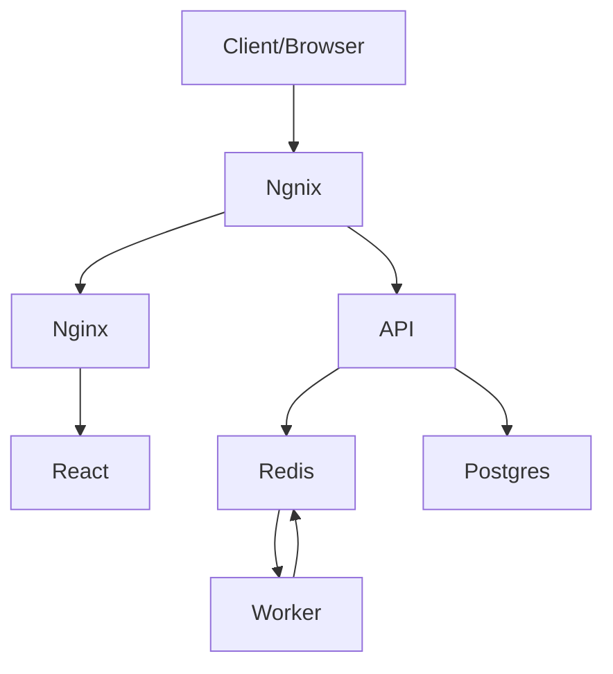

# Fiboker

An app to find the number in fibonacci sequence at given index

## Stack

This app was built using: Typescript, React, Node, Redis, Postgress and Docker

```mermaid
graph TD;
Client/Browser --> Ngnix;
Ngnix --> API
Ngnix --> Nginx --> React

API --> Redis
API --> Postgres
Worker --> Redis
Redis --> Worker
```
