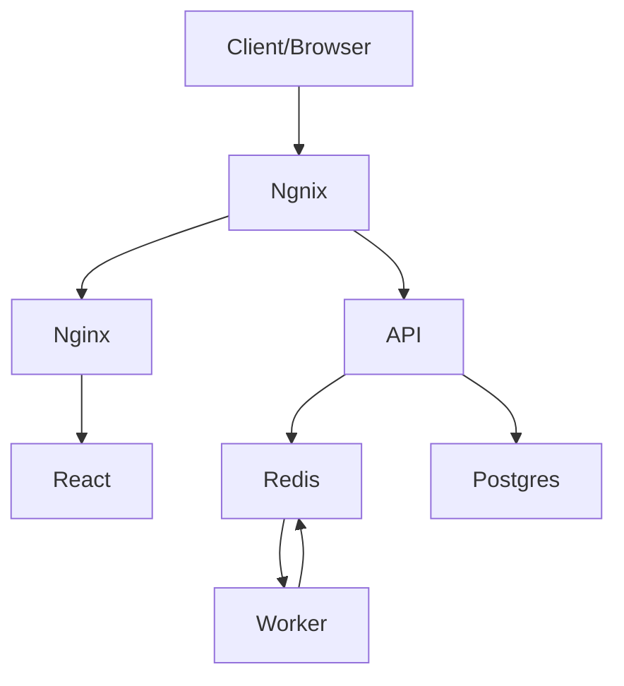

# Fiboker

An app to find the number in fibonacci sequence at given index.

The fibonacci sequence has been chosen here as an expensive task, and this architecture built to demonstrate how to work with such tasks.

## Stack

This app was built using: Typescript, React, Node, Redis, Postgress and Docker

This architecture was to complex for purpose of showing how to setup and work with multi containers application.
